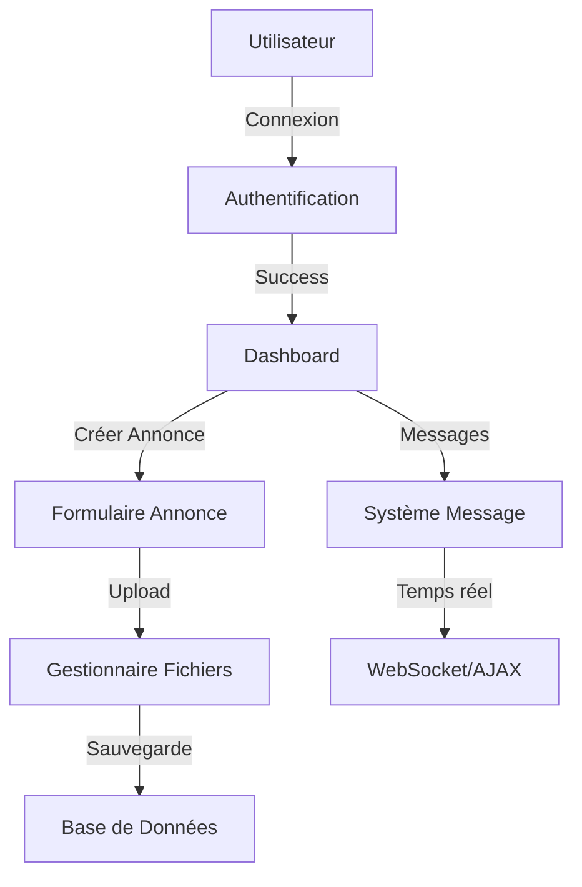

# ElectroBazar - Plateforme d'Annonces Tech 🚀

## Architecture du Projet
```
electrobazar/
├── assets/
│   ├── css/
│   │   └── styles.css
│   └── images/
│       └── default.jpg
├── functions/
│   ├── security.php
│   ├── file_handlers.php
│   └── logging.php
├── uploads/
│   ├── images/
│   └── brouillons/
├── config/
│   └── db.php
└── pages/
    ├── auth/
    │   ├── login.php
    │   └── register.php
    ├── annonces/
    │   ├── Depot_annonce.php
    │   └── voir_annonce.php
    └── messages/
        ├── messages.php
        └── conversation.php
```

## 📋 Prérequis

- PHP 8.0+
- MySQL 5.7+
- Apache 2.4+
- Extension PHP : PDO, GD, JSON
- Composer (optionnel)

## 🛠️ Installation

1. **Cloner le projet**
```bash
git clone https://github.com/votre-compte/electrobazar.git
cd electrobazar
```

2. **Configuration de la base de données**
```sql
source BDleboncoin.sql
```

3. **Configuration du fichier db.php**
```php
define('DB_HOST', 'localhost');
define('DB_NAME', 'electrobazar');
define('DB_USER', 'root');
define('DB_PASS', '');
```

## 🗂️ Structure des Dossiers

### 1. `assets/`
- Contient les ressources statiques (CSS, images)
- Le dossier `uploads/` stocke les images des annonces

### 2. `functions/`
- Modules réutilisables et utilitaires
- Gestion de la sécurité et des fichiers

### 3. `pages/`
- Contient toutes les pages de l'application
- Organisé par fonctionnalité

## 🔐 Sécurité

1. **Authentification**
- Session sécurisée
- Protection contre les injections SQL
- Mots de passe hashés avec `password_hash()`

2. **Upload de fichiers**
- Validation des types MIME
- Limite de taille (5MB)
- Renommage sécurisé

## 📱 Fonctionnalités Principales

### 1. Gestion des Annonces
- Création/Modification/Suppression
- Upload multiple d'images
- Sauvegarde en brouillon
- Système de favoris

### 2. Messagerie
- Conversations en temps réel
- Notification de nouveaux messages
- Suppression de messages

### 3. Recherche
- Filtrage par catégorie
- Recherche par mot-clé
- Tri par prix/date

## 🔄 Flux de données



## 🎨 Thème et Style

### Couleurs
```css
:root {
    --primary: #2980b9;
    --secondary: #e67e22;
    --success: #27ae60;
    --danger: #c0392b;
    --light: #ecf0f1;
    --dark: #2c3e50;
}
```

### Composants
- Bootstrap 5.3
- Font Awesome 6.5
- Custom CSS modulaire

## ⚠️ Points d'attention

1. **Performance**
- Optimiser les requêtes SQL
- Compression des images
- Mise en cache des données

2. **Maintenance**
- Logs détaillés dans `/logs`
- Sauvegarde régulière de la BDD
- Documentation du code

## 📞 Support

Pour toute question :
1. Consulter la documentation
2. Vérifier les logs
3. Contacter l'équipe technique

## 🔄 Mise à jour

1. Sauvegarder la base de données
2. Pull des dernières modifications
3. Vérifier les migrations
4. Vider le cache

## 📝 License

MIT License - Voir LICENSE.md
